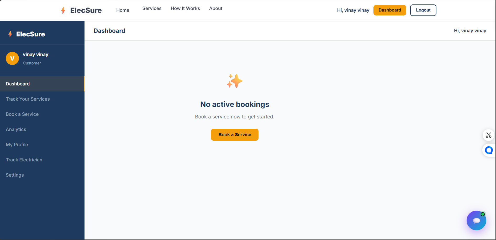
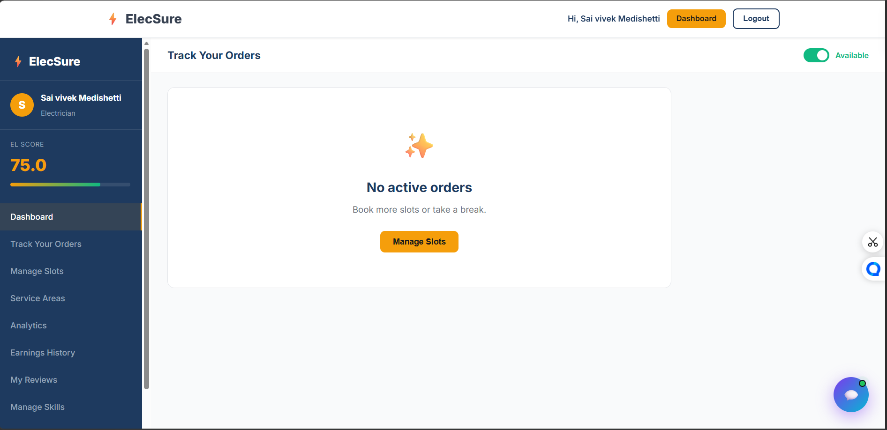

## ⚡ Quick Start

```bash
git clone <repo>
cd elecsure
cp .env.example .env
pip install -r requirements.txt
uvicorn main:app --reload
```

# ⚡ ElecSure — Home Electrical Services Platform

ElecSure is a production-inspired, full-stack platform designed to connect customers with verified professional electricians. Built with a focus on reliability, scalability, and modern engineering standards, ElecSure handles everything from service discovery and booking to live tracking and payment settlements.

## 🎯 Problem Statement

Finding reliable electricians is difficult due to:
- Lack of trust
- Unpredictable pricing
- Poor service tracking

ElecSure solves this with verified professionals, transparent pricing, and real-time tracking.

## 🚀 Key Features

-   **Customer Dashboard**: Book services, track electricians in real-time, and view spending analytics.
-   **Electrician Dashboard**: Manage availability slots, accept bookings, track earnings, and maintain an **EL Score**.
-   **EL Score System**: A proprietary quality metric for electricians based on ratings, cancellation rates, and toolkit quality.
-   **AI Assistant**: Context-aware chatbot (Gemini/Groq powered) for multi-role support.
-   **Multi-Provider AI**: Resilient AI routing with Groq (primary) and Gemini (fallback).
-   **Secure Payments**: Automated payment status transitions and support for both Online and Cash on Delivery (COD).
-   **Analytics Engine**: Detailed financial and performance reports for both users and providers.

---
## 🤖 AI Assistant

- Intelligent service recommendation based on user-described issues
- Context-aware responses using Groq
- Safety-aware guidance for electrical hazards

## 📸 Screenshots

### 👤 Customer Dashboard


### 🔧 Electrician Dashboard


## 🔄 Booking Flow


---

## 🛠️ Technology Stack


-   **Backend**: FastAPI (Python 3.10+)
-   **Database**: MySQL / MariaDB (SQLAlchemy + aiomysql)
-   **Frontend**: Vanilla JS, Modern CSS (Glassmorphism), HTML5
-   **Payments**: Stripe API
-   **Messaging**: Twilio (SMS/OTP)
-   **AI Engine**: Groq (Llama 3.1) & Google Gemini 2.0 Flash
-   **Task Runner**: APScheduler (Background jobs)
-   **Authentication**: JWT (Stateless) with Secure Password Hashing (Bcrypt)

---

## 🔌 API Overview

ElecSure provides RESTful APIs for authentication, booking, payments, and AI assistance.

### 🔐 Authentication
- POST /auth/register
- POST /auth/login

### 🛠️ Services
- GET /services
- GET /services/{id}

### 📅 Bookings
- POST /bookings
- GET /bookings/my
- PATCH /bookings/{id}/start
- PATCH /bookings/{id}/complete

### 💳 Payments
- POST /payments

### 🤖 AI Assistant
- POST /chat

👉 Full API documentation available at:
[API Docs](http://localhost:8000/api/docs)

---

## 🔧 Installation & Setup

### 1. Prerequisites
-   Python 3.10+
-   MySQL 8.0+
-   (Optional) Groq or Gemini API Key

### 2. Environment Setup
Clone the repository and create a virtual environment:
```powershell
python -m venv venv
.\venv\Scripts\activate  # Windows
source venv/bin/activate # Linux/Mac
```

Install dependencies:
```powershell
pip install -r requirements.txt
```

### 3. Database Configuration
Create the database:
```sql
CREATE DATABASE elecsure CHARACTER SET utf8mb4 COLLATE utf8mb4_unicode_ci;
```

### 4. Configure Environment Variables
Copy `.env.example` to `.env` and fill in your credentials:
```powershell
cp .env.example .env
```
*At a minimum, set `SECRET_KEY`, `DB_PASSWORD`, and `GROQ_API_KEY`.*

---

## 🚀 Running the Application

Start the production-ready development server:
```powershell
uvicorn main:app --reload
```
The application will be available at: `http://localhost:8000`

### Admin Access
-   **Dashboard**: `http://localhost:8000/admin/login`
-   **Interactive API Docs**: `http://localhost:8000/api/docs`

---

## 📂 Project Structure

```text
├── app/
│   ├── core/           # Config, database, security, and exceptions
│   ├── models/         # SQLAlchemy database models
│   ├── routers/        # FastAPI endpoint definitions (API & Pages)
│   ├── services/       # Business logic layer (The "Heart" of the app)
│   ├── templates/      # Jinja2 HTML templates
│   └── utils/          # Shared utility functions
├── scripts/            # Database migrations, seeders, and utility scripts
├── static/             # CSS, JS, Images, and static assets
├── main.py             # Application entry point & Lifespan management
└── requirements.txt    # Production-ready dependency manifest
```

---

## 🛡️ Engineering Standards

-   **Clean Code**: Modularized logic with a strictly separated services layer.
-   **Security**: No hardcoded secrets; Environment variables enforced via `pydantic-settings`.
-   **Robust Logging**: Structured logging replaces all `print` statements.
-   **Resilient AI**: Graceful fallback mechanisms for external API dependencies.
-   **Database Hygiene**: Async SQLAlchemy sessions with automated schema migration checks.

---
## 🚀 Deployment (Optional)

- Can be deployed using:
  - Docker
  - AWS EC2 / Render / Railway
- Requires:
  - MySQL instance
  - Environment variables
### Run:
```bash
uvicorn main:app --host 0.0.0.0 --port 8000
```

## ⚖️ License
This project is licensed under the MIT License.